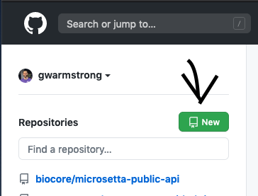

# BISB Bootcamp 2020: Software Engineering on a Team

## Objectives
- Concepts for working on code in a team
  - Defining the expected behavior of a program
    - Documentation
      - Tools:
        - Style guides, e.g.,
          - [NumPy docs](https://numpydoc.readthedocs.io/en/latest/format.html)
          - [Google Style guides](https://google.github.io/styleguide/pyguide.html)
    - Testing 
      - Tools:
        - [unittest](https://docs.python.org/3/library/unittest.html)
        - [pytest](https://docs.pytest.org/en/stable/)
  - Coordinating work among programmers
    - Version control
      - Tools:
        - [git](https://git-scm.com/)
        - [GitHub](https://github.com/)
    - Integration
      - Tools:
        - [GitHub](https://github.com/)
        - [Travis CI](https://travis-ci.com/)


## Presentation
You can find the slides presented for this module [here](
https://docs.google.com/presentation/d/1kUSg2BIn7K6VPMsXeiTBUf92P8GpfddPPAP3mMHCh0I/edit?usp=sharing).

## Getting started
### Setting up github repository (from scratch):
- Setting up on github.com
    - Navigate to [GitHub](https://github.com/)
    - Login to your github account
    - Create a new repository

      
      
    - Give it a <repository-name>
    - Other options (ignore for now)
    - Create Repository
- Create a local clone
```bash
git clone https://github.com/<your-username>/<repository-name>.git
cd <repository-name>
```

### Using (somebody else's) existing repository
- Navigate to repository you want to work on
- Fork it (should fork to your github account)

  
  
- Create a local copy
```bash
git clone https://github.com/<your-username>/<repository-name>.git
cd <repository-name>
```
- Set the upstream remote (lets you pull code from the other person's fork)
```bash
git remote add upstream https://github.com/<other-persons-username>/<repository-name>.git
```

### Checking out a new branch
```bash
git checkout -b branch-name
```

Then you can implement new features on this branch!


## Working on code
### Iteration 1

Writing a function to count how many times 'C' occurs in a string

Code:
```python
# dna_utils.py
def count_base(dna):
    """
    Counts the number of bases 'c' in a dna string
    
    Parameters
    ----------
    dna : str
        dna sequence to count 'c's in.
    """
    count = 0
    for base in dna:
        if base.lower() == 'c':
            count += 1
    return count
```

Tests:
```python 
# test_dna_utils.py
from .dna_utils import count_base

def test_count_base_with_2_c():
    s = "ACTGCG"
    assert count_base(s) == 2

def test_count_base_mixed_case_c():
    s = "AcTGCG"
    assert count_base(s) == 2
```

### Iteration 2

Update the function to count an arbitrary character

Code:
```python
# dna_utils.py
def count_base(dna, base='c'):
    """
    Counts the number of a given base in a dna string
    
    Parameters
    ----------
    dna : str
        dna sequence to count base in
    base : str
        character to count (default to 'c')
    """
    count = 0
    for base_ in dna:
       if base_.lower() == base:
           count += 1
    return count
```

Should also update the unit tests.

Tests:
```python
# test_dna_utils.py
# same as before
from .dna_utils import count_base

def test_count_base_with_2_c():
    s = "ACTGCG"
    assert count_base(s) == 2

def test_count_base_mixed_case_c():
    s = "AcTGCG"
    assert count_base(s) == 2

# new tests
def test_count_base_a():
    s = "ACTGCG"
    assert count_base(s, base='a') == 1
```

### Iteration 3

Now we want to be able to count multiple bases

Code:
```python
# dna_utils.py
def count_base(dna, base='c'):
    """
    Counts the number of given bases in a dna string
    
    Parameters
    ----------
    dna : str
        Dna sequence to count base in
    base : iterable
        characters to count (default to 'c')
    """
    count = 0
    for actual_base in dna:
        for count_base in base:
            if actual_base == count_base:
                count += 1
    return count
```

Tests:
```python
# test_dna_utils.py
# same as before
from .dna_utils import count_base

def test_count_base_with_2_c():
    s = "ACTGCG"
    assert count_base(s) == 2

def test_count_base_mixed_case_c():
    s = "AcTGCG"
    assert count_base(s) == 2

def test_count_base_a():
    s = "ACTGCG"
    assert count_base(s, base='a') == 1

# new tests
def test_count_base_multiple_bases():
    s = "ACTGCG"
    assert count_base(s, base=['A', 'G']) == 3
```
